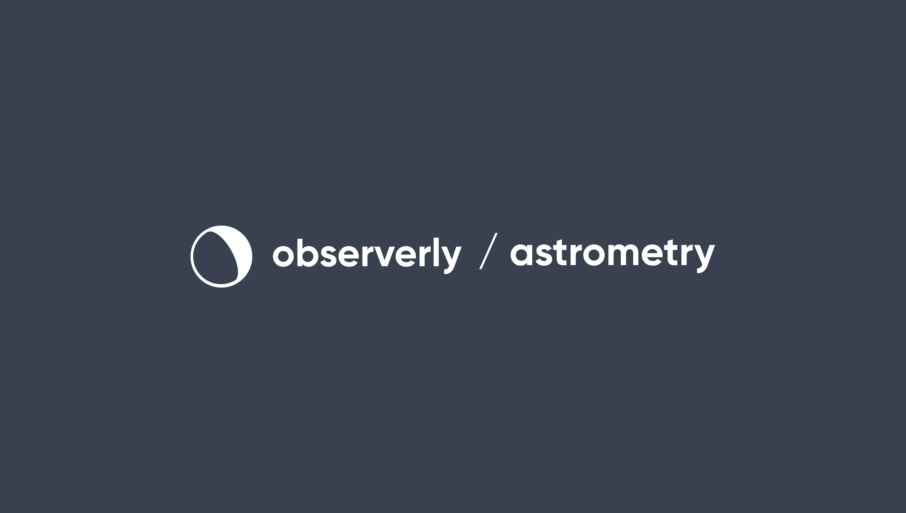

[](https:/observerly.com)

---

## Introduction

🔭 astrometry is observerly's lightweight, zero-dependency\*, type safe astrometry library written in TypeScript. It is aimed to be easy to use, and malleable to your usage, for amateur-astronomers and the general astronomy community to understand how positional astronomy works on a soft high-level.

The key tenants of the library is to use as JavaScript primatives. The notion of the JavaScript `Date` is relied upon heavily and we do not rely on, or enforce reliance on, any third-party datetime or timezone related libraries. This is to ensure that the library can be used in any environment, and that the user can supplement usage with their own datetime libraries of choice, if required.

The second key tenant, is that all coordinates are required to be in degrees for mathematical calculations, and, importantly, in the standard ICRS epoch J2000.

**N.B.** _This project is currently in the early stages of development and is not yet ready for production use._ As it is still in the early stages of development, the API is subject to change.

## Features

It can be used to calculate the horizontal position of the sun, moon, planets, and stars in the sky at a given time and location. You can convert any equatorial coordinate to horizontal coordinate, for any given time and location.

It can apply corrections for atmospheric refraction, parallax, nutation and aberration for epoch J2000 coordinates.

It can calculate the rise, transit, and set times of the sun, moon, and planets, as well as for any astronomical bodies.

It can calculate the phase, elongation, and angular size of the moon.

It can calculate horizontal altitude and the associated airmass of an object given a location and time.

## Usage

### Installation

You can install astrometry using your favorite package manager:

```bash
npm install @observerly/astrometry
```

or

```bash
yarn add @observerly/astrometry
```

```bash
pnpm add @observerly/astrometry
```

### Documentation

TBD

### Common Usage Examples

For all of the below examples, an "observer" at Manua Kea, Hawaii, US on the 14th May 2021 is assumed:

```typescript
// For these examples we need to specify a date because most calculations are
// differential w.r.t a time component. We set it to the author's birthday:
export const datetime = new Date('2021-05-14T00:00:00.000+00:00')

// For example we will fix the latitude to be Manua Kea, Hawaii, US
export const latitude = 19.820611

// For example we will fix the longitude to be Manua Kea, Hawaii, US:
export const longitude = -155.468094
```

To find the horizontal coordinate of, e.g., the star Betelgeuse, at a given time and location:

```typescript
import { type EquatorialCoordinate, convertEquatorialToHorizontal } from '@observerly/astrometry'

// Our astronomical target in this example is Betelgeuse, where
// the coordinate is given in epoch J2000 and in degrees:
const betelgeuse: EquatorialCoordinate = { ra: 88.7929583, dec: 7.4070639 }

// Perform the conversion:
const { alt, az } = convertEquatorialToHorizontal(datetime, { latitude, longitude }, betelgeuse)

// alt: 72.78539444063765
// az: 134.44877920325155
```

### Contributing

observerly welcomes contributions from everyone. Please read our [contributing guide](./CONTRIBUTING.md) for more information.

The TL;DR of the guideline is to follow these steps:

- Before creating an issue, ensure a similar issue does not already exist.
- Before creating a pull request, ensure a similar pull request does not already exist.

## Miscellany

\*It is dependency-free to ensure it can be used safely within both node, deno, bun and browser environments.

## License

@observerly/astrometry is licensed under the MIT license. See [MIT](./LICENSE) for details.
