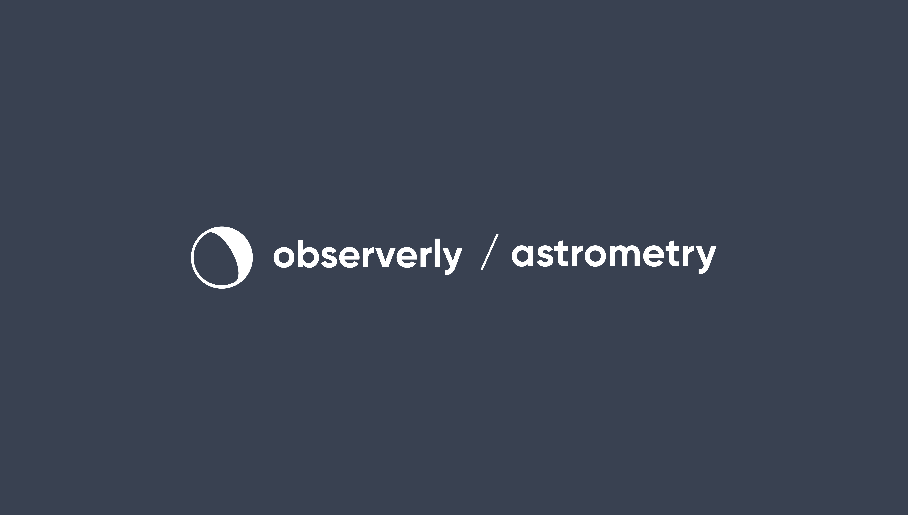

[](https:/observerly.com)

---

## Introduction

🔭 astrometry is observerly's lightweight, zero-dependency\*, type safe astrometry library written in TypeScript. It is aimed to be easy to use, and malleable to your usage, for amateur-astronomers and the general astronomy community to understand how positional astronomy works on a soft high-level.

The key tenants of the library is to use as JavaScript primatives. The notion of the JavaScript `Date` is relied upon heavily and we do not rely on, or enforce reliance on, any third-party datetime or timezone related libraries. This is to ensure that the library can be used in any environment, and that the user can supplement usage with their own datetime libraries of choice, if required.

The second key tenant, is that all coordinates are required to be in degrees for mathematical calculations, and, importantly, in the standard ICRS epoch J2000.

**N.B.** _This project is currently in the early stages of development and is not yet ready for production use._ As it is still in the early stages of development, the API is subject to change.

## Features

It can be used to calculate the horizontal position of the sun, moon, planets, and stars in the sky at a given time and location. You can convert any equatorial coordinate to horizontal coordinate, for any given time and location.

It can apply corrections for atmospheric refraction, parallax, nutation and aberration for epoch J2000 coordinates.

It can calculate the rise, transit, and set times of the sun, moon, and planets, as well as for any astronomical bodies.

It can calculate the phase, elongation, and angular size of the moon.

It can calculate horizontal altitude and the associated airmass of an object given a location and time.

## Usage

### Installation

You can install astrometry using your favorite package manager:

```bash
npm install @observerly/astrometry
```

or

```bash
yarn add @observerly/astrometry
```

```bash
pnpm add @observerly/astrometry
```

### Conventions

Spherical coordinates follow [ISO 80000-2](https://www.iso.org/standard/64973.html), in which the polar angle is denoted θ (theta) and the azimuthal angle is denoted φ (phi):

| Angle           | Symbol | Range      | Corresponds to                                     |
| --------------- | ------ | ---------- | -------------------------------------------------- |
| Polar angle     | θ      | [-90, 90]  | altitude (alt), declination (dec), latitude        |
| Azimuthal angle | φ      | [0, 360)   | azimuth (az), right ascension (ra), longitude      |

N.B. ISO 80000-2 measures the polar angle from the zenith, e.g., the positive z-axis, giving a range of [0, 180]. As is conventional in astronomy, we instead measure it from the reference plane, e.g., the horizon or the celestial equator, giving a range of [-90, 90], such that θ is the altitude or the declination of a target directly, and not its complement.

The mathematical convention, in which θ and φ are transposed, is **not** used. Both angles are of type `number`, so transposing them is silent, e.g.:

```ts
import { getAngularSeparation } from '@observerly/astrometry'

// The polar angle, θ, is the declination, and the azimuthal angle, φ, is the right ascension:
const separation = getAngularSeparation(
  { θ: arcturus.dec, φ: arcturus.ra },
  { θ: spica.dec, φ: spica.ra }
)
```

θ and φ are reserved for the two angles above, and are not used to denote any other quantity, e.g., an angular separation is named `separation`, and not φ.

Other symbols follow their conventional usage for the quantity in question, and are unrelated to the above, e.g., λ and β for ecliptic longitude and latitude, l and b for galactic longitude and latitude, and φ for the geographic latitude of an observer in the local scope of a calculation.

### Documentation

TBD

### Common Usage Examples

For all of the below examples, an "observer" at Manua Kea, Hawaii, US on the 14th May 2021 is assumed:

#### Setup

```typescript
// For these examples we need to specify a date because most calculations are
// differential w.r.t a time component. We set it to the author's birthday:
export const datetime = new Date('2021-05-14T00:00:00.000+00:00')

// For example we will fix the latitude to be Manua Kea, Hawaii, US
export const latitude = 19.820611

// For example we will fix the longitude to be Manua Kea, Hawaii, US:
export const longitude = -155.468094
```

To find the horizontal coordinate of, e.g., the star Betelgeuse, at a given time and location:

#### Horizontal Position of Betelgeuse

```typescript
import { type EquatorialCoordinate, convertEquatorialToHorizontal } from '@observerly/astrometry'

// Our astronomical target in this example is Betelgeuse, where
// the coordinate is given relative to the epoch J2000 and in units of degrees:
const betelgeuse: EquatorialCoordinate = { ra: 88.7929583, dec: 7.4070639 }

// Perform the conversion:
const { alt, az } = convertEquatorialToHorizontal(datetime, { latitude, longitude }, betelgeuse)

// alt: 72.78539444063765
// az: 134.44877920325155
```

#### Precession of Equinoxes

Let's say we also wish to apply corrections for the precession of equinoxes:

```typescript
// Get the correction to the equatorial coordinate for for the precession of equinoxes:
const { ra: δra, dec: δdec } = getCorrectionToEquatorialForPrecessionOfEquinoxes(
  datetime,
  betelgeuse
)

// Perform the conversion:
const { alt, az } = convertEquatorialToHorizontal(
  datetime,
  { latitude, longitude },
  {
    ra: betelgeuse.ra + δra,
    dec: betelgeuse.dec + δdec
  }
)

// alt: 72.59159652271458
// az: 133.7382466535349
```

This will give you the horizontal coordinates of Betelgeuse at the given time and location, with the correction for the precession of equinoxes applied.

Corrections for atmospheric refraction, parallax, nutation and aberration can also be applied in a similar manner to get an accurate horizontal position of the star.

#### Sunrise, Solar Noon & Sunset

To find the sunrise, solar noon and sunset for a given date and location:

```typescript
import { getSolarNoon, getSunrise, getSunset } from '@observerly/astrometry'

// The sunrise of the given date for the observer, or null for an observer in
// a polar day or a polar night:
const sunrise = getSunrise(datetime, { latitude, longitude })

// sunrise: 2021-05-14T15:46:15.680Z

// The solar noon of the given date for the observer, which is resolved for
// every observer, including an observer in a polar day or a polar night:
const noon = getSolarNoon(datetime, { latitude, longitude })

// noon: 2021-05-14T22:18:12.533Z

// The sunset of the given date for the observer, or null likewise:
const sunset = getSunset(datetime, { latitude, longitude })

// sunset: 2021-05-15T04:50:22.158Z
```

The times follow the standard almanac convention: sunrise and sunset are the instants at which the geometric altitude of the centre of the Sun crosses the standard altitude of -0.8333°, which carries the ~16 arcminute semidiameter of the Sun and the standard ~34 arcminutes of atmospheric refraction at the horizon, e.g., the instants at which the upper limb of the Sun appears to touch the horizon. The standard altitude is further depressed below the astronomical horizon for an observer at an elevation.

The algorithm proceeds as follows:

- The geocentric apparent place of the Sun is resolved from the full VSOP87 planetary theory, evaluated at the Terrestrial Time of the given date, corrected for nutation and the aberration of light, and referred to the true equator and equinox of the date.
- The solar noon is the meridian transit of the Sun, resolved by a bisection of the hour angle of the Sun through zero about the mean solar noon of the given date, e.g., it is not the culmination, which the motion of the Sun in declination displaces from the meridian by tens of seconds at an equinox.
- The sunrise and sunset are resolved by a bisection of the geometric altitude of the Sun through the standard altitude, between the meridian transit and the lower culmination half a solar day to either side of it, between which the altitude is monotonic and crosses the horizon at most once.

Every time is verified against the NREL Solar Position Algorithm of Reda, I., & Andreas, A. (2004), "Solar position algorithm for solar radiation applications", Solar Energy, 76(5), 577-589, to within ±2 seconds across a spread of latitudes, seasons and epochs, by the conformance suite in `tests/conformance`.

### Contributing

observerly welcomes contributions from everyone. Please read our [contributing guide](./CONTRIBUTING.md) for more information.

The TL;DR of the guideline is to follow these steps:

- Before creating an issue, ensure a similar issue does not already exist.
- Before creating a pull request, ensure a similar pull request does not already exist.

## Private Publishing

To ensure that the private package repository is correctly configured, you will need to add the following to your `.npmrc` file:

```bash
//npm.pkg.github.com/:_authToken=${GITHUB_TOKEN}
@observerly:registry=https://npm.pkg.github.com
```

And then run the following command from the root of the repository:

```bash
pnpm publish --registry=https://npm.pkg.github.com/ --access public --//npm.pkg.github.com/:_authToken=$GITHUB_AUTH_TOKEN
```

## Miscellany

\*It is dependency-free to ensure it can be used safely within both node, deno, bun and browser environments.

## License

@observerly/astrometry is licensed under the MIT license. See [MIT](./LICENSE) for details.
